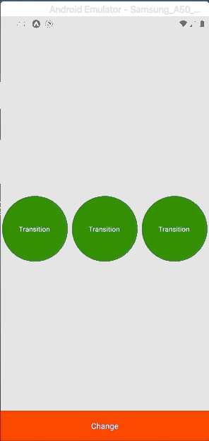
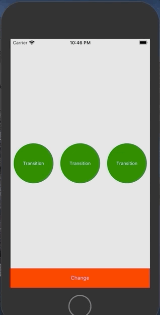

<h4 align="center">
  Smooth transitions with <a href="https://github.com/software-mansion/react-native-reanimated">React Native Reanimated</a>
</h4>

<p align="center">
  <a href="#information_source-how-to-use">How To Use</a>&nbsp;&nbsp;&nbsp;|&nbsp;&nbsp;&nbsp;
  <a href="#memo-license">License</a>
</p>

<p align="center">
  
  &nbsp;&nbsp;&nbsp;
  
</p>


## :information_source: How To Use

```bash
# Configure expo (https://expo.io)

# Clone this repository
$ git clone https://github.com/renatobentorocha/transition-1.git transition

# Go into the repository
$ cd transition

# Install dependencies
$ yarn

# Run the app (iOS)
$ expo start --ios

# Run the app (Android)
$ expo start --android
```

## :memo: License
This project is under the MIT license. See the [LICENSE](LICENSE) for more information.

---

Made with ♥ by Renato Rocha :wave: [Get in touch!](https://www.linkedin.com/in/renato-rocha-62146a74/)
